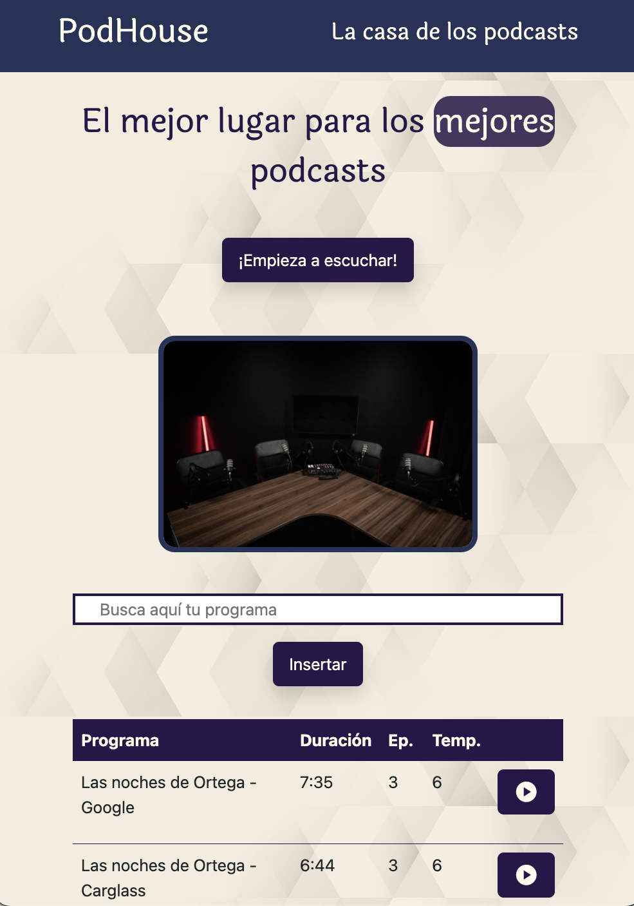
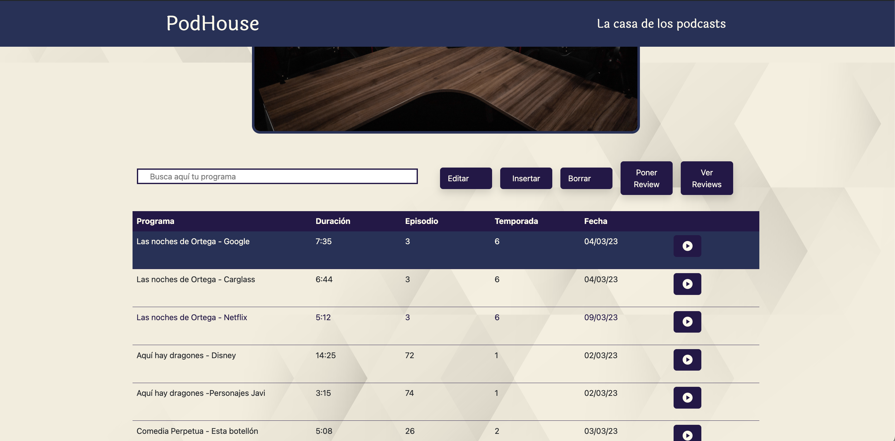
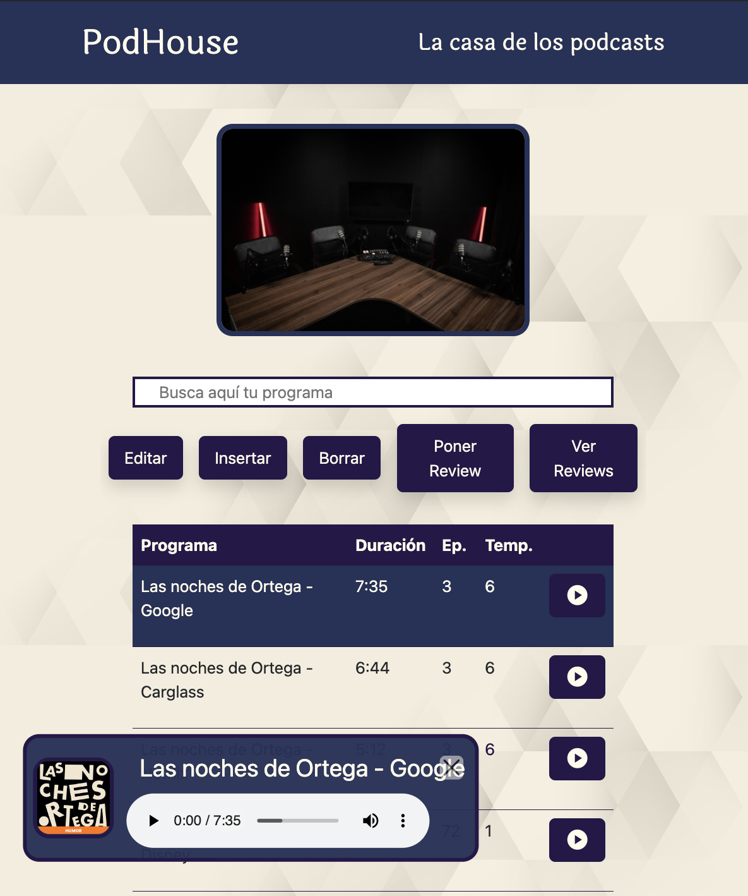
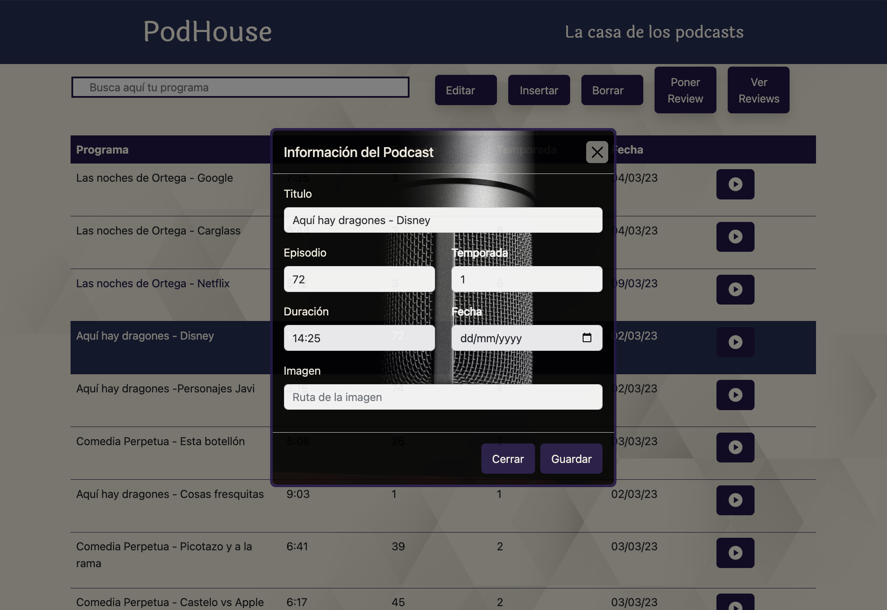

Esto es un pequeño proyecto que hice para aprender a crear una página web.
Es una página muy simple que ofrece trozos de podcasts de humor. Me sirvió para aprender a usar HTML, CSS, JavaScript y
responsive design.

